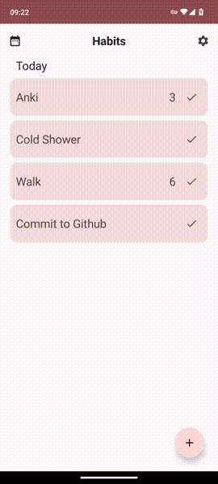
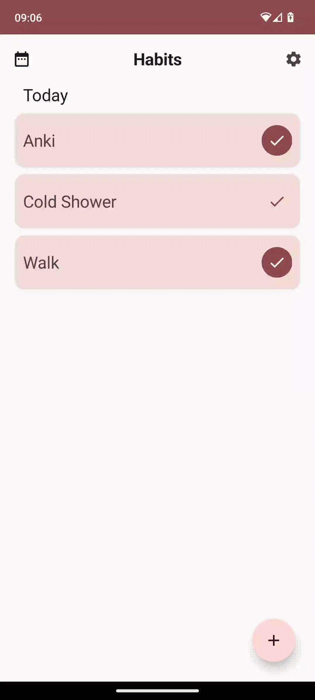
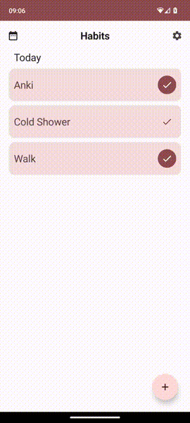

# Habits ✅

Android app for tracking and helping to maintain good habits built in Jetpack Compose

## Screenshots





## Features

- **Supports material you** - Habits follows the
  latest [Material Design guidelines](https://m3.material.io/) and supports dynamic colour theming
  out of the box.
- **Ad-free and open source** - Free forever, Habits is completely free with no in app purchases or
  subscriptions.
- **Offline and privacy respecting** - Habits can be used in it's entirety without an internet
  connection, your information is never sent to anyone and is always kept on your device.

## Licence

```
MIT License

Copyright (c) 2023 Will Spooner

Permission is hereby granted, free of charge, to any person obtaining a copy
of this software and associated documentation files (the "Software"), to deal
in the Software without restriction, including without limitation the rights
to use, copy, modify, merge, publish, distribute, sublicense, and/or sell
copies of the Software, and to permit persons to whom the Software is
furnished to do so, subject to the following conditions:

The above copyright notice and this permission notice shall be included in all
copies or substantial portions of the Software.

THE SOFTWARE IS PROVIDED "AS IS", WITHOUT WARRANTY OF ANY KIND, EXPRESS OR
IMPLIED, INCLUDING BUT NOT LIMITED TO THE WARRANTIES OF MERCHANTABILITY,
FITNESS FOR A PARTICULAR PURPOSE AND NONINFRINGEMENT. IN NO EVENT SHALL THE
AUTHORS OR COPYRIGHT HOLDERS BE LIABLE FOR ANY CLAIM, DAMAGES OR OTHER
LIABILITY, WHETHER IN AN ACTION OF CONTRACT, TORT OR OTHERWISE, ARISING FROM,
OUT OF OR IN CONNECTION WITH THE SOFTWARE OR THE USE OR OTHER DEALINGS IN THE
SOFTWARE.
```
