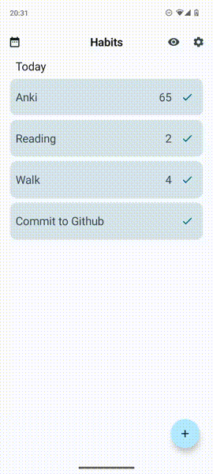

# Habits ✅


Habits is an app for tracking and helping to maintain good habits.
It is currently in development, with plans to release on Google Play and F-Droid.

## Screenshots




## Features

- **Build habits that last** - Completing habits is easy, whenever one is due simply tick it from
  the today view to complete it.
- **Learn about your habits** - Habits will calculate a score for each of your habits, so you can
  see if you are on track to achieving your goals.
- **Track weekly or daily habits** - Running twice a week? Piano on a Thursday? With Habits you can 
  track what habits you perform each week.
- **The full picture** - You can visualise your habits over past months in the logbook view.
- **Fluent animations** - Built with the latest Android technologies, every action in Habits is
  beautifully animated to make completing habits satisfying.
- **Supports material you** - Habits follows the
  latest [Material Design guidelines](https://m3.material.io/) and supports dynamic colour theming
  out of the box.
- **Ad-free and open source** - Free forever, Habits is completely free with no in app purchases or
  subscriptions.
- **Offline and privacy respecting** - Habits can be used in it's entirety without an internet
  connection, your information is never sent to anyone and is always kept on your device.

## Privacy Policy
Any data generated or input into Habits is always stored locally on your device, and is never sent to the developers of Habits or any third parties. Developers of Habits or any third parties do not have access to your data. Habits contains no advertisement, tracking or analytics code.

## Licence

```
Copyright (C) 2023 Will Spooner

This program is free software: you can redistribute it and/or modify
it under the terms of the GNU General Public License as published by
the Free Software Foundation, either version 3 of the License, or
(at your option) any later version.

This program is distributed in the hope that it will be useful,
but WITHOUT ANY WARRANTY; without even the implied warranty of
MERCHANTABILITY or FITNESS FOR A PARTICULAR PURPOSE.  See the
GNU General Public License for more details.

You should have received a copy of the GNU General Public License
along with this program.  If not, see <https://www.gnu.org/licenses/>.
```
