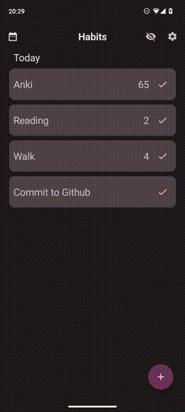
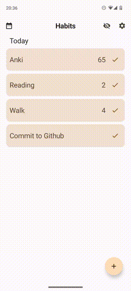

# Habits ✅

Android app for tracking and helping to maintain good habits built in Jetpack Compose

## Screenshots

## Features

- **Supports material you** - Habits follows the
  latest [Material Design guidelines](https://m3.material.io/) and supports dynamic colour theming
  out of the box.
- **Ad-free and open source** - Free forever, Habits is completely free with no in app purchases or
  subscriptions.
- **Offline and privacy respecting** - Habits can be used in it's entirety without an internet
  connection, your information is never sent to anyone and is always kept on your device.
